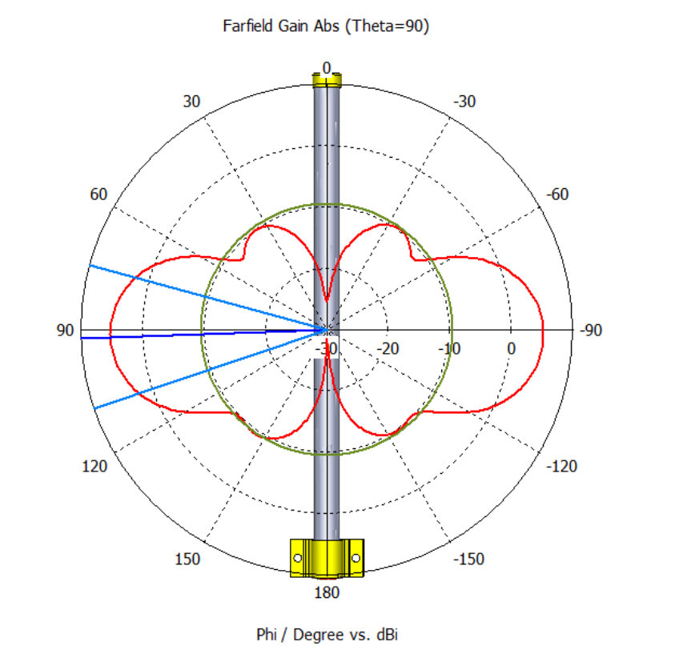
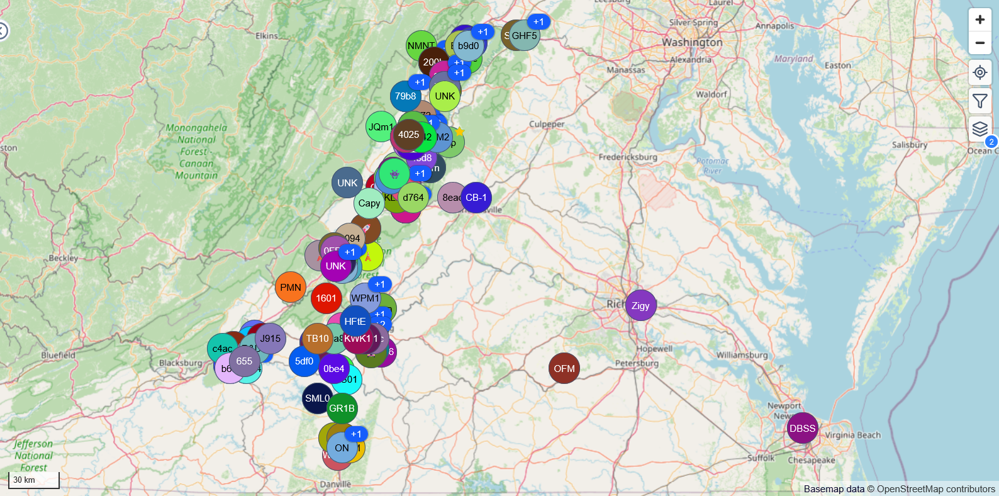
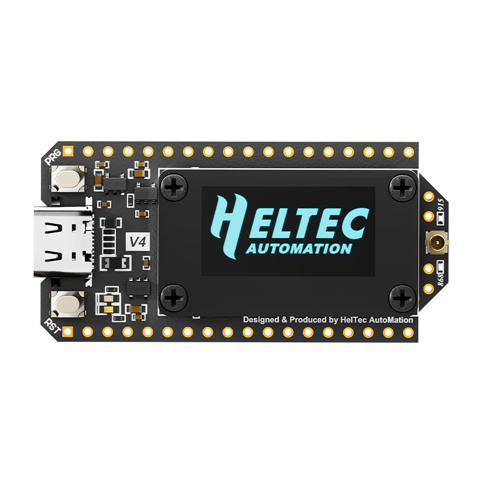
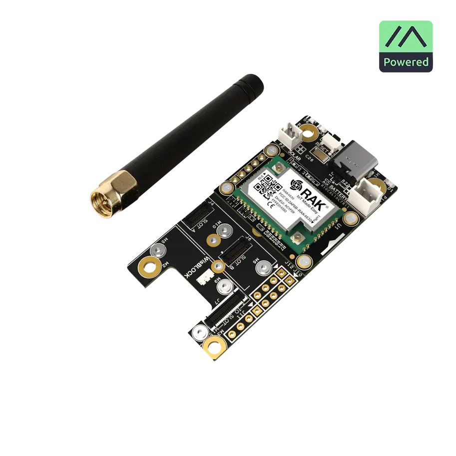
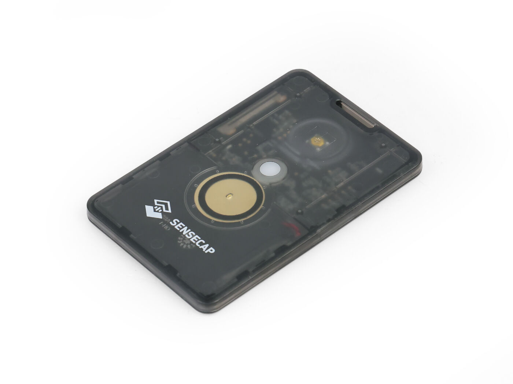
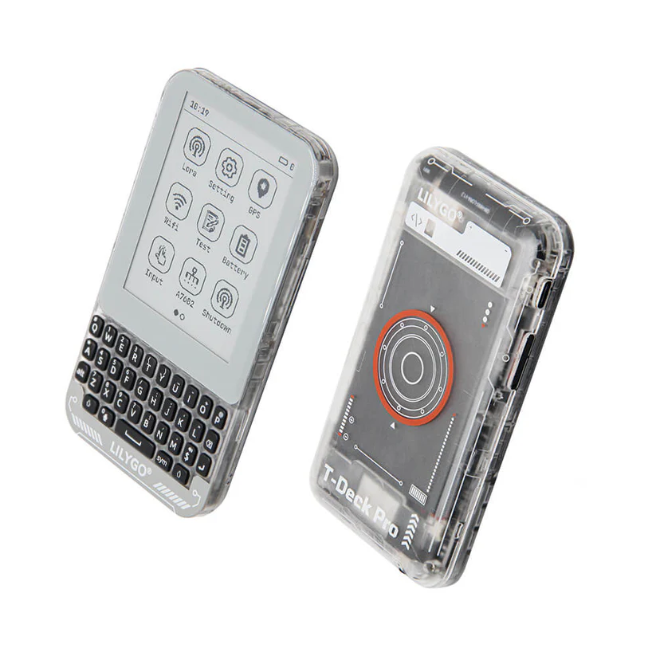
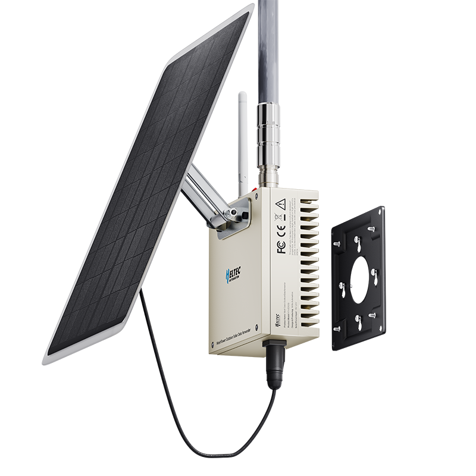

# Meshtastic

Off-Grid Communication For Everyone

or From Marconi to Meshtastic in 10 Minutes

---
# Tonight's Plan

- A bit of radio theory
- Meshtastic overview
- Build your own node
- Scatter and test the mesh

In a few minutes, you will need:

- Chrome-based browser on your laptop
- Meshtastic app on your phone

---
# Radio theory 101

- The electro-magnetic (EM) spectrum covers a huge range of radio, light, and up to xrays
- Frequency is measured in waves per second as hertz (Hz)
- Generally, lower frequency gives us longer range but lower data rates, vs high frequency at short range
- At the very low end, individual Hz can transmit through the entire ocean and only carry a few characters per minute
- At the high end, xrays are measured in petahertz to exahertz

---
# Radio trivia

- Different frequencies exhibit wildly different properties
  - Following earth's curve or bouncing off the atmosphere
  - Being blocked by fog due to water absorbtion
  - Passing through solid objects
- As you move from Hz to EHz, large ranges are given fun names like "low", "medium", and "high" frequency
- Usage of different segments often agreed by international treaty to allow portability
- Each segment comes with different rules about who can use it, why, and how. Some are purchased, some are open to the public, some just require registration

---
# Key points along the spectrum

- Extremely low frequency - 3-30Hz used to contact submarines, antennas 14-28 miles long
- Medium frequency - 300 kHz to 3 MHz, AM radio from 525 kHz to 1705 kHz
- Very high frequency - 30 to 300 MHz, FM radio from 87 to 108 MHz
- Ultra high frequency - 300 MHz to 3 GHz, Meshtastic at 915MHz, Wifi at 2.4GHz
- Super high frequency - 3 to 30 GHz, 5.8 GHz WiFi, 24GHz JMU building to building links
- Purple - 700 THz

---
# More radio trivia

- Each device will have a center frequency and channel width
- Sometimes these are given short names to make configuration easier
  - For example, WiFi "channel 32" is centered at 5160 MHz and is 20MHz wide, meaning it uses 5150–5170 MHz
- WiFi allows you to change the center frequency and the width to optimize bandwidth and interference from neighbors
- Install Ubiquiti WiFiman (iOS or Android) some day to visualize the WiFi environment

---
# LTE and ISM

- LTE cell phones can use up to 100 different channels, depending on country and provider. Frequencies range from 400 to 5900 MHz
- Industrial, scientific, and medical (ISM) frequencies are largely unregulated/unlicensed world-wide
- 13 different frequencies including 900 MHz, 2.4GHz, and 5.8GHz used by Meshtastic, WiFi, and Bluetooth
- You must not intentionally cause interference for others and must accept accidental interference you receive
- Strict limits around transmit power levels

---
# Antennas

- Antennas help guide EM waves toward recipients and reject unwanted noise
- Very narrow antennas like satellite dishes can aim a signal at an exact point a very long way away
- Sector antennas can be seen on cell towers, possibly around 60° to 90° width, to separate customers in different areas
- Omni-directional antennas can send in 360°, in one or both planes
- Coax and fiber optic cables guide a signal exactly from one point to another
- Manufacturers publish charts to help choose the right product and installation method

---

---

---
# Meshtastic

What you're actually here for...

---
# Meshtastic overview

- Low power, low cost radios connected over unlicensed channels
- 902.0 - 928.0 MHz in the US, 869.4 - 869.65 MHz internationally
  - Some radios can be tuned, try to buy the right one, especially the antenna
- Text messages and sensor readings relayed
- Messages broadcast between hops until time-to-live (TTL) expires
  - Default 3 hops, can be extended to 7
- Typical range listed as 1-3 miles, mesh to 60 miles, single link record of 206 miles
- 260-270 nodes visible from Harrisonburg
- Devices beacon every few hours, can take a while to discover neighbors

---

---
# Meshtastic location data

- Location data is self-reported and can be inaccurate
  - Optional GPS module
  - Can use phone info via app
  - Radios onboard flights sending stale information
- Your location can be obscured by limiting lat/long decimals
- Optionally, only transmit location on private channels
- Wifi-enabled boards can relay via internet MQTT giving extreme "range"

---
# Meshtastic encryption

- All communications encrypted
- 8-bit short keys for public channels (`AQ==` default, `pg==` Harrisonburg)
- 128/256 bit AES keys for private use
- Nodes relay messages regardless of their ability to decrypt
- Node public/private keys autogenerated, must be validated manually/offline for DMs

---
# Meshtastic node types

- CLIENT - default, relays all traffic, participates in mesh
- CLIENT_MUTE - receive-only, better for edge or limited visibility nodes
- CLIENT_BASE - prefer/only relay "favorite" nodes
- REPEATER/ROUTER - only relay, nodes are not expected to originate messages
- A few other very specialized roles
- Stay with default CLIENT unless you have a specialized setup

---
# Meshtastic LoRa settings

- Broadcast can be tuned based on expected range and number of nodes
- Can broadcast quickly for short-range, high node count environments
- Can broadcast slowly for long-range, high background noise environments
- Default LONG_FAST, range from SHORT_TURBO to VERY_LONG_SLOW
- Frequency can be manually specified, otherwise the name of the primary channel is hashed to a frequency

---
# Heltec v4

- Powered by ESP32 (dual-core 240 MHz, 2MB RAM)
- Integrated screen and wifi
- Sensors via soldered pins
- Relatively power hungry
- We're using these tonight

---
# RAKwireless 4631

- Powered by nRF52840 (64MHz CPU, 256KB RAM)
- Flexible baseboards with module connections
- Temperature, pressure, humidity, accelerometer, GPS, and screen modules
- Excellent power usage for battery/solar use

---
# SenseCAP Tracker T1000-E

- Same nRF52840 low-power CPU
- Integrated GPS, battery, button, and buzzer
- Button combos to acknowledge message or send current position
- Mesh AirTag

---
# LILYGO T-Deck Pro

- ESP32 CPU, integrated keyboard, screen, and battery
- Portable text messaging

---
# Solar nodes

- Remote solar nodes are a popular way to extend the mesh
- Need to be carefully designed for battery temperature, wind loads, and lightning

---
# Build a node

What you're really, really here for...

---
# Build a node - hardware setup

- Connect LoRa antenna FIRST!!
  - Never power a radio without its antenna
  - Press the connector flat, be careful but requires some force
- Connect power

---
# Build a node - software update

- Go to <https://flasher.meshtastic.org>
- Select Heltec v4 device
- Select firmware version 2.7.15 Beta
- Select Flash
- Do not do 1200bps reset or change 115200 baud rate
- Select `Full Erase and Install`

(pause here)

---
# Build a node - software update

- Hold PRG while you tap the RST button
- The board will reboot in update mode
- Select Update to begin
- When the update looks complete, you may need to hit RST to reboot again

---
# Build a node - configuration

- Go to <https://client.meshtastic.org>
- Add a connection via serial
- Board may reboot after each setting change. Count to 5, check screen for status
- Click Settings, then Device Config
- Set short and long device name

---
# Build a node - configuration

- Go to Radio Config, then Channels
- On the Primary channel, set your location data preference
- Save, possibly reboot between each channel page
- Add UUG and JMU channels (copy these from Discord)
  - UUG: `0ztAT+L+N7Ixo6a0GRH1BHgePpP6BAwgOTQTaJ+Od24=`
  - JMU: `9XF5AXZh0G7c3Jlk3nO6Iw==`

---
# Build a node - configuration

- Go back to Radio Config, then LoRa
- Set region to US
- Make sure you've rebooted the board by now
- Go to the Messages page, and send a test message to the UUG channel

---
# Build a node - go mobile

- Pair phone over Bluetooth
- Pairing code will be shown on screen
- Go test!
  - USB power available under benches throughout the building
- Leave $20 and you can keep the board (Venmo @ripleymj)
- Join the conversation on UUG Discord #meshtastic
